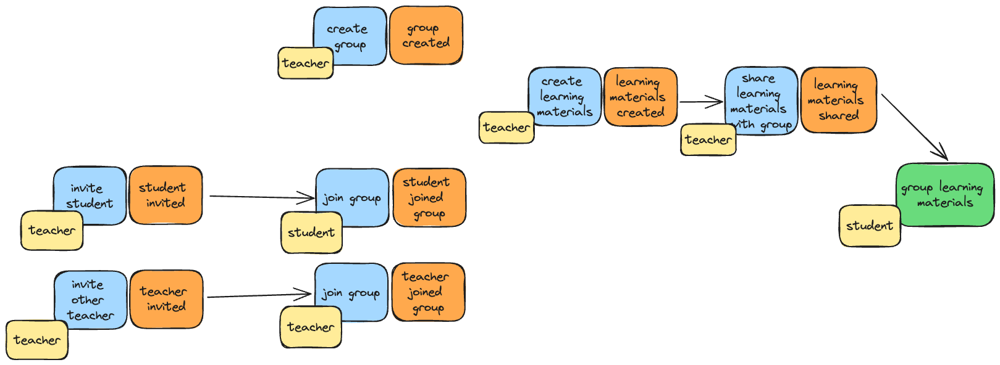

# Go to school
This is a project that I decided to learn Go lang with. And as it is about learning, let's keep it close to the education domain 🤓.

This is the domain I'm going to work with


## DB migration
Install migrate CLI: 
```sh
brew install golang-migrate
```

Create new migration
- update migration name in makefile
- run `make migrate-new`